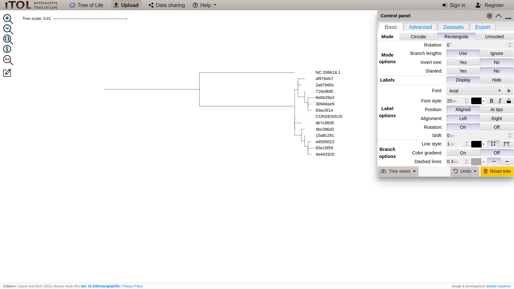

# [Playing well with others: Combining HapLink with external tools](@id integration-tutorial)

HapLink is not a one-man show: it knows how to cooperate with other
tools! In this tutorial, we'll let HapLink do the haplotype calling, but use
other tools to go from reads to variant calls, and from haplotypes to
phylogenies.

```@contents
Pages = ["3-other.md"]
```

## Install the other tools

Before we get too far, let's make sure that we actually have all of the tools
that we need. Let's create a brand new conda environment.

```bash
conda create \
  -n haplink-tutorial-3 \
  -c bioconda \
  -c conda-forge \
  wget=1.20 \
  sra-tools=3.0 \
  entrez-direct=16.2 \
  samtools=1.17 \
  minimap2=2.26 \
  lofreq=2.1 \
  haplink \
  mafft=7.520 \
  raxml-ng=1.2 \
  -y
conda activate haplink-tutorial-3
```

!!! info "Output"
    
      - None

## Get sample data

We'll pull some of the validation data data from NCBI. First, the reference
genome from GenBank.

```bash
esearch \
    -db nucleotide \
    -query "NC_036618.1" \
  | efetch \
    -format fasta \
  > idv4.fasta
```

Next, we'll download one of the pools from the validation set from SRA.

```bash
fasterq-dump --concatenate-reads -X "SRR24796010" | gzip > "IDV-Aug2022-P2.fastq.gz"
```

!!! info "Output"
    
      - idv4.fasta
      - IDV-Aug2022-P2.fastq.gz

## Align sequences

We have a set of Nanopore reads and a reference genome to go with them. We'll
use [minimap2](https://doi.org/10.1093/bioinformatics/bty191) to align the reads
to reference. minimap2 requires the `-a` flag to output in SAM format, and uses
the `-x` flag to tweak the settings for optimal Nanopore alignment. We then run
those reads through `samtools sort` and `samtools index` to reduce the
computational load needed to find reads by our downstream tools, and
`samtools view -b` to convert the SAM file into a compressed BAM file.

```bash
minimap2 \
    -t $(($(nproc)/2)) \
    -ax map-pb \
    idv4.fasta \
    IDV-Aug2022-P2.fastq.gz \
  | samtools sort \
  | samtools view \
    -@ $(($(nproc)/2)) \
    -b \
    -h \
  > IDV-Aug2022-P2.bam
samtools index IDV-Aug2022-P2.bam
```

!!! info "Output"
    
      - IDV-Aug2022-P2.bam
      - IDV-Aug2022-P2.bam.bai

## Call variants

People are picky about their variant callers. Even
[viralrecon](https://nf-co.re/viralrecon) can't decide which caller to use. If
you don't like HapLink's built-in variant caller, that's fine! Here, we'll use
[LoFreq](https://doi.org/10.1093/nar/gks918) (another fine variant caller) to
decide for us whether nucleotide variations are variants, or just randomness.
The only requirement is that the output _must_ be in VCF format (looking at you,
[iVar](https://doi.org/10.1186/s13059-018-1618-7)) for HapLink to read it.

```bash
lofreq faidx idv4.fasta
lofreq call-parallel \
  --pp-threads $(($(nproc)/2)) \
  --call-indels \
  --ref idv4.fasta \
  IDV-Aug2022-P2.bam \
  --out IDV-Aug2022-P2.vcf
```

!!! info "Output"
    
      - IDV-Aug2022-P2.vcf

## Call haplotypes

And we're back... We now have each piece (reference, alignment, variant calls)
needed for HapLink to find haplotypes.

```bash
export JULIA_NUM_THREADS=$(($(nproc)/2))
haplink haplotypes \
  idv4.fasta \
  IDV-Aug2022-P2.vcf \
  IDV-Aug2022-P2.bam \
  > IDV-Aug2022-P2.yml
haplink sequences \
  idv4.fasta \
  IDV-Aug2022-P2.yml \
  > IDV-Aug2022-P2.fasta
```

!!! info "Output"
    
      - IDV-Aug2022-P2.yml
      - IDV-Aug2022-P2.fasta

## Alignment (again, but on a bigger scale)

Now that we have the sequences of every haplotype that HapLink found, we can go
farther and see how they compare altogether. We'll use
[MAFFT](https://doi.org/10.1093/nar/gkf436) to generate a multiple sequence
alignment of every haplotype. By comparing everything to everything, we can
start to see patterns that may have been masked by comparing to the reference
genome.

```bash
cat idv4.fasta IDV-Aug2022-P2.fasta > sequences.fasta
mafft \
  --thread $(($(nproc)/2)) \
  --auto \
  sequences.fasta \
  > haplotypes.fas
```

!!! info "Output"
    
      - sequences.fasta
      - haplotypes.fas

## Phylogeny

Although the human brain is _reasonably_ good at picking up pattern differences,
we can mathematically determine the similarities between sequences using a
phylogeny. We'll use [RAxML-NG](https://doi.org/10.1093/bioinformatics/btz305)
to solve the phylogeny for us. Note that RAxML-NG produces _a lot_ of output.

```bash
raxml-ng --all \
  --threads auto{MAX} \
  --msa haplotypes.fas \
  --model GTR+G
```

!!! info "Output"
    
      - haplotypes.fas
      - haplotypes.fas.raxml.bestModel
      - haplotypes.fas.raxml.bestTree
      - haplotypes.fas.raxml.bestTreeCollapsed
      - haplotypes.fas.raxml.bootstraps
      - haplotypes.fas.raxml.log
      - haplotypes.fas.raxml.mlTrees
      - haplotypes.fas.raxml.rba
      - haplotypes.fas.raxml.startTree
      - haplotypes.fas.raxml.support

You can now import the `haplotypes.fas.raxml.bestTree` file into a phylogeny
viewer to view the tree. A personal favorite around our lab is
[iTOL](https://itol.embl.de/), but many others will work.



* * *

Now you can do some heavy lifting with HapLink and its friends! You can leave
the tutorials and check out the [CLI reference](@ref variants-cli), for an
in-depth examination of everything you just learned, or dive into the [next
tutorial](@ref repl-tutorial) to learn how to call haplotypes _without leaving
the Julia REPL._
